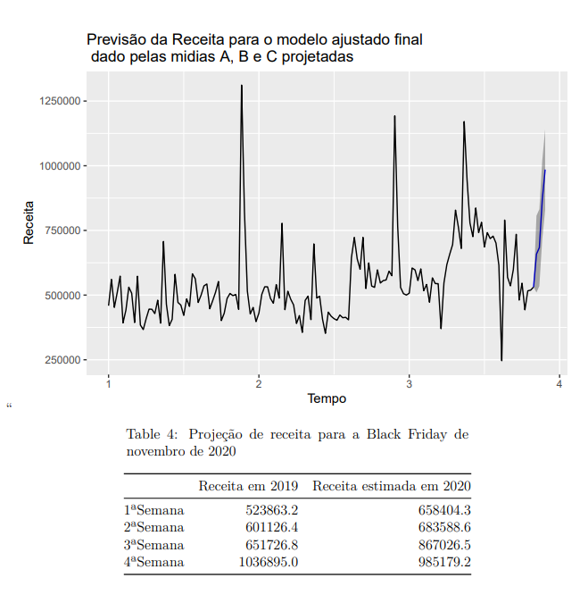
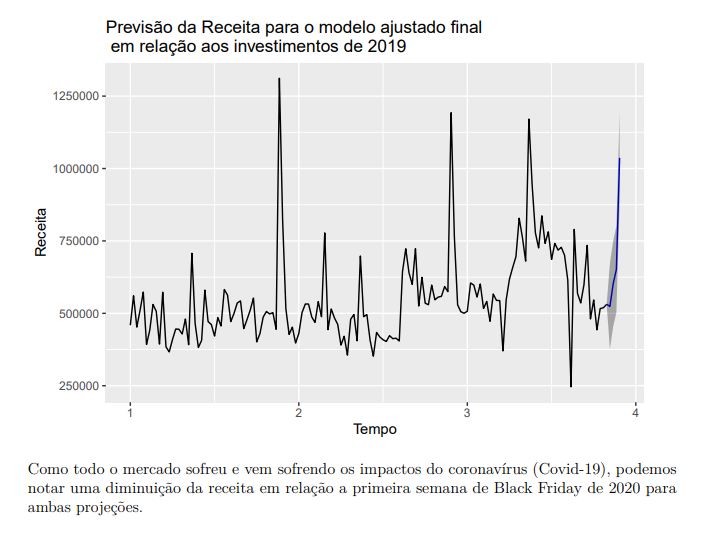

    
 
## Case Analista de Dados: BlackFriday
#### Desafio de Avaliação para vaga de Analista de Dados junto a empresa Calina.

## Objetivo do Case
 
    
Em uma agência de marketing digital, um dos períodos mais importantes para o setor de e-commerce é a Black Friday, uma data sazonal em que muitos clientes se planejam com promoções e ações por meio de mídias pagas para atrair a atenção dos usuários. Pensando nessa ocasião especial, um cliente da Calina solicitou uma análise para prever qual será a receita durante a Black Friday de 2020.

O banco de dados enviado contém informações de três mídias nas quais o cliente investe (Mídia A, Mídia B e Mídia C), além do total da receita gerada no site por semana, desde a primeira semana de 2018 até a última semana de outubro de 2020.

Para responder à solicitação do cliente, analise o banco de dados, crie um modelo de teste e um modelo final, que deverá prever as próximas quatro semanas, correspondentes ao mês de novembro de 2020 (sendo a última delas a semana da Black Friday).

## Conteúdo do projeto

 - [`Analise.pdf`](./AnaliseRegressao/Analise.pdf) - Apresentação completa da anlise realizada, com todas as informações:
    - Desafio e Objetivo do Case
    - Tratamento e limpeza dos dados
    - Análise exploratória e descritiva dos dados
    - Estudo de outliers e distribuição
    - Desenvolvimento e execução dos modelos de Regressão
    - Avaliação de resultados sazonalidade. 
  - [`Analise.Rmd`](./AnaliseRegressao/Analise.Rmd) - Artefato origem da análise

#### Dependências
-  R>=3.5

## Predição obtida

   

